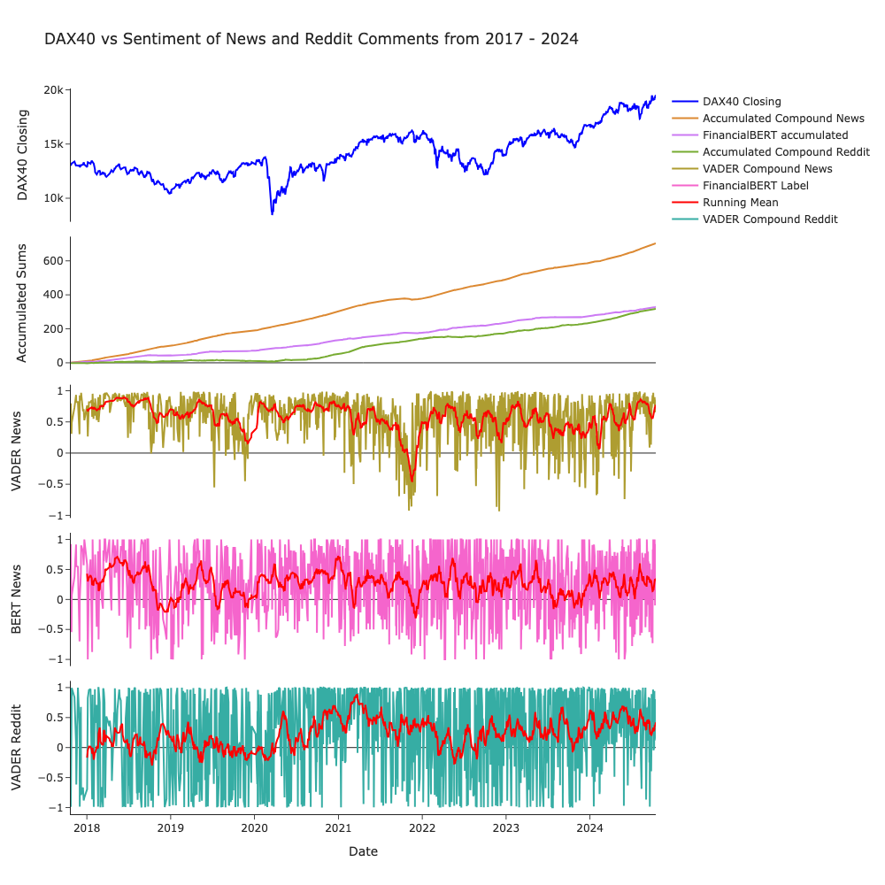
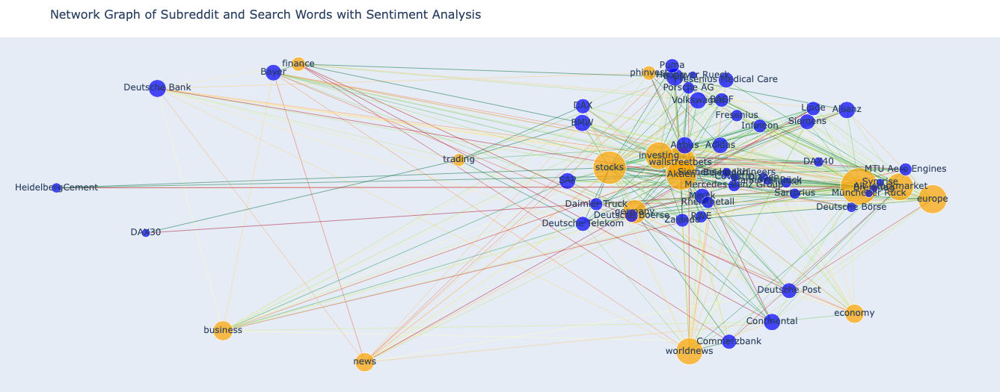

# 🧩 UniversityProject-DaxNewsSentiment

Ein Projekt zur Sammlung, Übersetzung und Sentiment-Analyse von Finanznachrichten (DAX-relevant) und Reddit-Daten. Enthält Jupyter-Notebooks zum Crawlen von Links, Herunterladen von Artikeln, Übersetzen und Ermitteln von Sentiment-Werten.





## 🚀 Übersicht
Dieses Repository ist ein Universitätsprojekt zur Analyse von Finanznachrichten mit Fokus auf den DAX. Ziel ist es, Nachrichtenartikel und Reddit-Beiträge zu sammeln, (falls nötig) zu übersetzen und anschliessend mit einfachen Sentiment-Methoden zu bewerten.

Haupt-Features:
- Sammlung von Nachrichten-Links und Artikeln (Notebooks im Ordner `code/`).
- Übersetzung von Texten (z. B. DE → EN) für einheitliche Sentiment-Verarbeitung.
- Basale Sentiment-Berechnung und Export der annotierten Datensätze.
- Enthält Rohdaten im `data/`-Ordner für Reproduzierbarkeit.


## 📌 Verwendung
Die Hauptarbeit geschieht in Jupyter-Notebooks unter `code/`. Empfohlener Workflow:

1. `code/get_links.ipynb` — Links sammeln / organisieren.
2. `code/get_news.ipynb` — Artikeltexte herunterladen und in `data/news/` oder `data/` speichern.
3. `code/translate_news.ipynb` / `code/tanslate_reddit.ipynb` — Optionale Übersetzung (z. B. mit Google Translate API oder einem lokalen Modell).
4. `code/make_sentiment.ipynb` — Sentiment-Berechnung und Zusammenführung der Datensätze.


## 🗂️ Projektstruktur
Eine vereinfachte Übersicht (relevante Dateien / Ordner):

```
/.                         # Repository root
├─ code/                   # Jupyter-Notebooks zur Datensammlung & -verarbeitung
│  ├─ get_links.ipynb
│  ├─ get_news.ipynb
│  ├─ make_sentiment.ipynb
│  ├─ reddit.ipynb
│  ├─ tanslate_reddit.ipynb
│  └─ translate_news.ipynb
├─ data/                   # Gesammelte Rohdaten, CSVs und Link-Listen
│  ├─ links/               # Aufgesplittete Link-Listen
│  ├─ news/                # Rohtexte (z. B. news_text-*.csv)
│  └─ *.csv                # z. B. finance_news_with_sentiment.csv
├─ capstone.ipynb
├─ pyproject.toml
└─ LICENSE
```

Tabelle: Schlüssel-Dateien
| Pfad | Zweck |
|---|---|
| `code/get_links.ipynb` | Sammelt / aggregiert Artikel-URLs |
| `code/get_news.ipynb` | Lädt Artikeltexte anhand der Links |
| `code/translate_news.ipynb` | Übersetzt gesammelte Nachrichten |
| `code/make_sentiment.ipynb` | Berechnet Sentiment und exportiert CSV |
| `data/` | Enthält Rohdaten, Linklisten und erzeugte CSVs |

## 🔬 Architektur & Verarbeitungspipeline
Kurzform:
1. Link-Sammlung → 2. Artikelscraping → 3. (Optional) Übersetzung → 4. Textvorverarbeitung → 5. Sentiment-Analyse → 6. Export/Visualisierung.

Die konkreten Implementierungsdetails (z. B. welche Sentiment-Bibliothek verwendet wird) sind in den jeweiligen Notebooks dokumentiert. Für reproduzierbare Experimente empfiehlt sich, die genutzten Bibliotheken in `requirements.txt` oder `pyproject.toml` festzuhalten.

## 📈 Beispiele / Visualisierungen
Die Notebooks enthalten zumeist kleine Visualisierungen (z. B. Zeitreihen der Sentiment-Scores oder Häufigkeitsdiagramme). Screenshots können direkt aus Jupyter exportiert werden.


## 👥 Autoren / Kontakt
- Marco Banzhaf 

